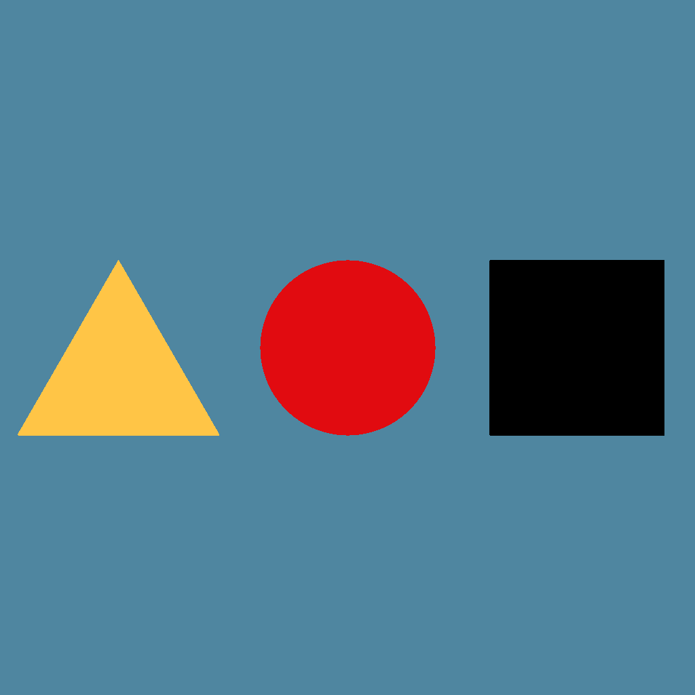
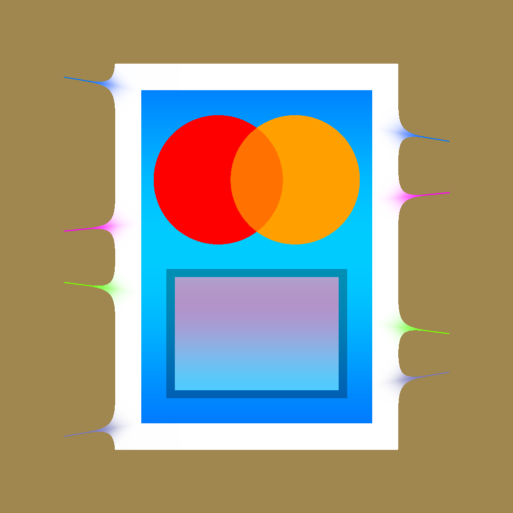
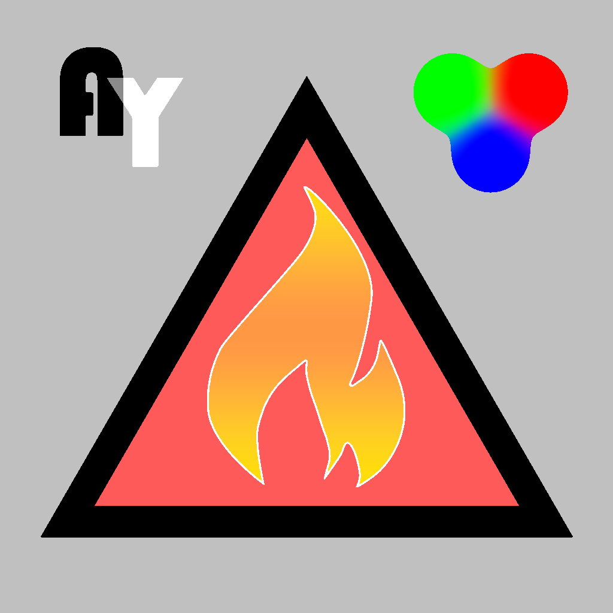

# Signed distance function rendering 
Task from the Forward and Inverse Rendering course at CMC MSU

## Galery
| Primitives showcase       | Intersections and gradients | Image SDFs            |
|---------------------------|-----------------------------|-----------------------|
|  |     |  |

## Done
### Main
- [x] **(1 point)** Signed distance functions for geometric primitives (circle, rectangle, segment and triangle)
- [x] **(1 point)** Overlaying and intersecting of shapes with color blending
- [x] **(1 point)** Loading SDF from files and rendering them with changing scale
### Bonus
- [x] **(1 point)** Gradient fill
- [x] **(1 point)** Object borders

## Build
```bash
mkdir build
cd build
cmake ..
make -j
```
